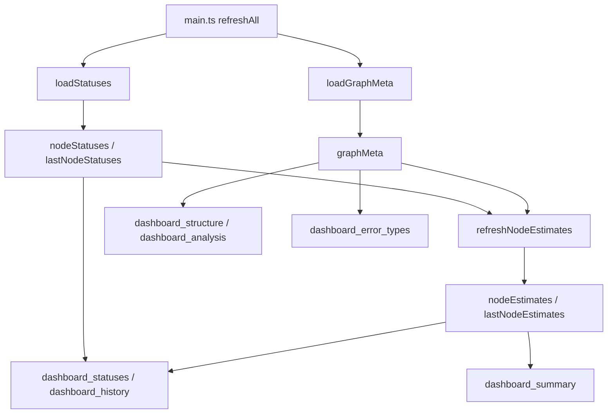

# src/celestialflow_web/static/ts/loaders.ts

> 📅 最后更新日期: 2026/09/24

数据层：模型状态与拉取。负责指标数据的拉取、版本守卫与本地派生。

> 渲染模块只读取这里暴露的全局变量，不自行发起请求 —— 这样"数据从哪来"与"数据怎么画"不再混在同一个文件里。契约类型见 [`types.d.ts`](types.d.md)；命名以 `load*` 开头的函数是唯一的网络入口。

## 类型定义

```typescript
/**
 * 由前端从状态快照与静态拓扑推导出的图级派生值
 *
 * 不与 NodeStatus 混放：这两项需要全图信息才能算出，属于本地派生而非上报内容。
 */
export type NodeEstimate = {
  total_tasks_pending: number;   // 总待处理任务数（含下游链路）
  total_remaining_time: number;  // 预计总剩余秒数（考虑各条链路状态）
};
```

## 全局变量

| 变量 | 类型 | 说明 |
|------|------|------|
| `nodeStatuses` | `Record<string, NodeStatus>` | 当前各节点运行状态 |
| `lastNodeStatuses` | `Record<string, NodeStatus>` | 上一轮状态快照，用于计算增量 |
| `nodeEstimates` | `Record<string, NodeEstimate>` | 本轮图级派生值，与 `nodeStatuses` 同步轮转 |
| `lastNodeEstimates` | `Record<string, NodeEstimate>` | 上一轮派生值，用于计算增量 |
| `lastStatusTimestamp` | `number` | 最近一次状态快照的统一时间戳，供历史曲线记录使用 |
| `graphMeta` | `GraphMeta` | 图元信息（有向图 + 节点元信息 + 分析结果） |

模块内部还维护请求版本与竞态序列号（不导出）：`statusRev`、`statusesRequestSeq`、`graphMetaRev`、`graphMetaRequestSeq`。默认值 `-1` 表示首次拉取全量。

## 函数

### `loadStatuses(): Promise<boolean>`

异步从 `GET /api/pull_status?known_rev=N` 拉取节点状态并更新全局变量。

- **竞态保护**：为每次请求分配递增 `statusesRequestSeq`，序列号不匹配时丢弃响应。
- **快照轮转**：成功后把旧的 `nodeStatuses` 移入 `lastNodeStatuses`，并更新 `lastStatusTimestamp`。
- **返回值**：数据版本变化并成功更新时返回 `true`。
- 全局估算与历史曲线同步由 `main.ts` 的 `refreshAll()` 收口处理，本函数不负责。

### `loadGraphMeta(): Promise<boolean>`

异步从 `GET /api/pull_graph_meta?known_rev=N` 拉取图元信息（图拓扑 + 节点构建期元信息 + 图分析结果），一次更新全局 `graphMeta`。使用 `graphMetaRequestSeq` 作竞态保护。

### `refreshNodeEstimates(): void`

基于同一快照内的原始计数与静态拓扑，刷新各节点的图级派生值 `nodeEstimates`：

- `total_tasks_pending` 与 `total_remaining_time` 需要每个节点的计数、每边输出量，以及图元信息提供的拓扑与 DAG 判定。
- 图元信息尚未就绪（`graphMeta.nodes` 为空或 `analysis` 为 `null`）时直接返回，避免静默算出退化结果。
- 非 DAG 无法拓扑传播，`total_tasks_pending` 退化为节点自身的待处理量（`calcGlobalPending` 只在 DAG 上调用）。
- 结果写入前把旧的 `nodeEstimates` 移入 `lastNodeEstimates`。

估算本身由 [`util_estimators.ts`](util_estimators.md) 的 `calcGlobalPending()` 与 `calcRemaining()` 完成。

## 数据流



## 使用示例

```typescript
import { loadStatuses, loadGraphMeta, refreshNodeEstimates, nodeStatuses, graphMeta, nodeEstimates } from "./loaders.js";

// 拉取一轮数据
const statusesChanged = await loadStatuses();
const graphMetaChanged = await loadGraphMeta();

// 图元信息就绪后统一收口本地派生
if (statusesChanged || graphMetaChanged) {
  refreshNodeEstimates();
}

console.log(Object.keys(nodeStatuses), graphMeta.nodes, nodeEstimates);
```
