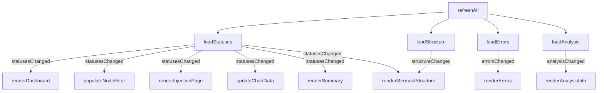
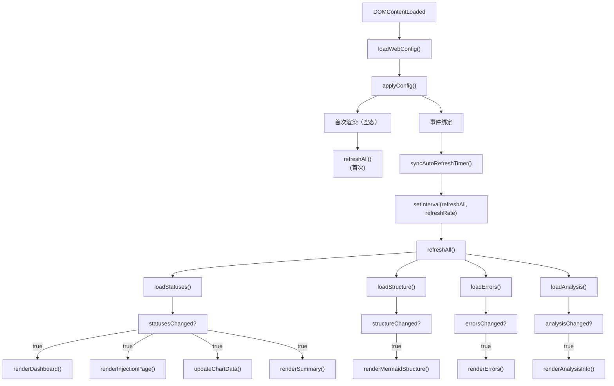

# main.ts

> 📅 最后更新日期: 2026/06/22

仪表盘主入口脚本，负责协调全局初始化、事件监听及核心数据轮询逻辑。

> ⚠️ **已变更**: 旧版文档提及的 `loadSummary()` 和 `initSortableDashboard()` 已移除。`refreshAll()` 现并行 4 个请求（statuses、structure、errors、analysis），summary 由 `renderSummary()` 直接基于 `nodeStatuses` 前端聚合。新增了 `updateCurrentPageSettings()`、`activateTab()` 等设置面板管理函数。

## 全局变量

| 变量 | 类型 | 说明 |
|------|------|------|
| `refreshRate` | `number` | 轮询刷新间隔（毫秒），默认 `5000` |
| `refreshIntervalId` | `ReturnType<typeof setInterval> \| null` | 轮询定时器 ID |
| `settingsStatusTimer` | `ReturnType<typeof setTimeout> \| null` | 设置保存状态提示自动隐藏定时器 |

## DOM 元素引用

| 变量 | DOM 选择器 | 说明 |
|------|-----------|------|
| `refreshSelect` | `#refresh-interval` | 刷新间隔下拉框 |
| `autoRefreshToggle` | `#auto-refresh-toggle` | 自动刷新开关 |
| `historyLimitSelect` | `#history-limit` | 历史长度下拉框 |
| `settingsBtn` | `#settings-btn` | 设置齿轮按钮 |
| `settingsPanel` | `#settings-panel` | 设置悬浮面板 |
| `themeToggleBtn` | `#theme-toggle` | 主题切换按钮 |
| `languageSelect` | `#language-select` | 语言选择下拉框 |
| `errorPageSizeSelect` | `#error-page-size` | 错误每页条数下拉框 |
| `errorJumpToInjectionToggle` | `#error-jump-to-injection-toggle` | 错误页重注入后跳转开关 |
| `structureEdgeDeltaToggle` | `#structure-edge-delta` | 结构图边增量显示开关 |
| `statusTotalPendingToggle` | `#status-total-pending-toggle` | 节点状态卡等待值模式开关 |
| `injectableOnlyToggle` | `#injectable-only-toggle` | 注入页"仅显示可注入节点"开关 |
| `tabButtons` | `.tab-btn` | 页签按钮列表 |
| `tabContents` | `.tab-content` | 页签内容列表 |
| `settingsClose` | `#settings-close` | 设置面板关闭按钮 |
| `settingsStatus` | `#settings-status` | 设置保存状态提示 |
| `settingsCurrentGroup` | `#settings-current-group` | 当前页设置分组容器 |
| `settingsCurrentLabel` | `#settings-current-label` | 当前页设置分组标题 |
| `settingsCurrentEmpty` | `#settings-current-empty` | 当前页无专属设置提示 |
| `settingsCurrentItems` | `[data-settings-tab]` | 当前页设置项列表 |

## 核心功能

### 轮询刷新 (`refreshAll`)

并行发起 4 个异步请求：`loadStatuses()`、`loadStructure()`、`loadErrors()`、`loadAnalysis()`。根据各模块返回的变更标志，按需触发 DOM 渲染。



### 设置交互

| 设置项 | 事件 | 触发行为 |
|-------|------|----------|
| **刷新间隔** | `change` | 更新 `refreshRate`，保存配置，重建定时器 |
| **自动刷新** | `change` | 切换 `autoRefreshEnabled`，同步定时器，保存配置 |
| **历史长度** | `change` | 更新 `historyLimit`，裁剪历史并重绘，保存配置 |
| **界面语言** | `change` | `setLang()` + `applyI18nDOM()`，全量刷新所有卡片和图表 |
| **结构图增量** | `change` | 切换 `showStructureEdgeDelta`，重绘 Mermaid，保存配置 |
| **节点等待模式** | `change` | 切换 `useTotalPendingInStatus`，重绘节点卡，保存配置 |
| **注入页节点过滤** | `change` | 切换 `showInjectableOnly`，刷新注入页，保存配置 |
| **错误页大小** | `change` | 更新 `pageSize`，重新加载错误列表，保存配置 |
| **错误重注入跳转** | `change` | 切换 `jumpToInjectionAfterRetry`，保存配置 |
| **明暗主题** | `click` | 切换 `dark-theme` 类，更新图表主题色，保存配置 |

### UI 辅助函数

#### `toggleDarkTheme(): boolean`
在 `body` 元素上切换 `dark-theme` 类，返回切换后是否为暗黑模式。

#### `showSettingsSaveStatus(messageKey: string): void`
在设置面板底部显示限时的状态提示（成功 2 秒、失败 5 秒后自动隐藏）。

#### `updateSettingsStatusText(): void`
语言切换后更新设置状态提示的文本。

#### `syncAutoRefreshTimer(): void`
根据 `webConfig.global.autoRefreshEnabled` 创建或清除轮询定时器。

#### 设置面板管理
`isSettingsPanelOpen()` / `openSettingsPanel()` / `closeSettingsPanel(options?)` / `toggleSettingsPanel()` — 管理设置面板的显隐与焦点归还。
`updateSettingsStatusText()` — 语言切换后刷新设置保存状态提示文案。

#### 页签管理
`getActiveTab(): string` / `activateTab(button): void` / `updateCurrentPageSettings(): void` — 管理顶部页签切换和设置面板中"当前页专属设置"分组。

## 数据流向图



## 使用示例

```typescript
// 手动触发完整刷新
// await refreshAll();

// 修改轮询频率
// refreshRate = 2000;
// syncAutoRefreshTimer();

// 主题切换
// const isDark = toggleDarkTheme();
// themeToggleBtn.textContent = isDark ? t("theme.light") : t("theme.dark");
// updateChartTheme();
// renderMermaidStructure(nodeStatuses);

// 切换页签
// activateTab(document.querySelector('[data-tab="errors"]'));
```
