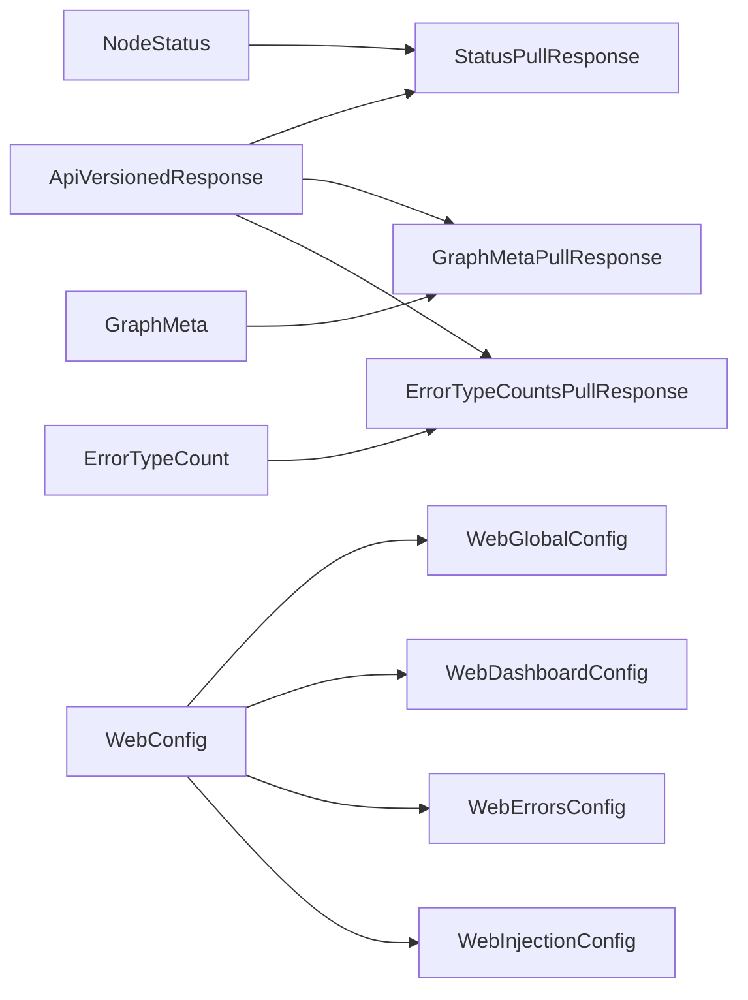

# src/celestialflow_web/static/ts/types.d.ts

> 📅 最后更新日期: 2026/09/24

前后端契约类型声明。只收纳"从本前端之外送来"的数据形状：HTTP 接口的 payload / 响应，以及配置文件结构；前端本地派生（如 `NodeEstimate`）或只服务于单个渲染器的词汇（如 `NodeShape`）留在各自文件里。

> 本文件是纯类型声明（`.d.ts`），不产生 `.js` 产物，因此无需在 `scripts.html` 中引用。

## 通用

```typescript
export type Lang = "zh-CN" | "en" | "ja"; // 支持的界面语言

type ApiVersionedResponse<T> = {
  rev: number;  // 当前数据版本号
  data: T | null; // 当 known_rev 未变化时可能返回 null
};
```

## 节点状态：`/api/pull_status`

```typescript
/** 节点运行时状态快照定义（与后端 payload 的字段形状一致） */
export type NodeStatus = {
  status: number;              // 状态码：0-未运行, 1-运行中, 2-已停止
  tasks_processed: number;     // 已处理任务总数
  tasks_pending: number;       // 队列中等待的任务数
  tasks_succeeded: number;     // 成功处理的任务数
  tasks_failed: number;        // 处理失败的任务数
  tasks_duplicated: number;    // 被去重过滤的任务数
  upstream_counts: Record<string, number>;   // 各上游节点传输给本节点的任务数量
  downstream_counts: Record<string, number>; // 本节点传输给各下游节点的任务数量
  start_time: number;          // 启动 Unix 时间戳
  elapsed_time: number;        // 已运行秒数
};

export type StatusPullResponse = ApiVersionedResponse<Record<string, NodeStatus>> & {
  timestamp: number; // 本次状态快照的统一时间戳
};
```

> `execution_mode` / `max_workers` 等构建期元信息不在状态快照里，而在图元信息 `node_meta` 中。

## 图元信息：`/api/pull_graph_meta`

```typescript
/** 节点的构建期元信息，不进每轮状态快照 */
type NodeMeta = {
  class_name: string;     // 节点类名（TaskStage/TaskSplitter/TaskRouter）
  execution_mode: string; // 运行模式（serial/thread/async）
  max_workers: number;    // 最大并发数
};

/** 图拓扑分析结果，随图元信息一次性到达 */
type AnalysisData = {
  name: string;                            // 任务图名称
  startTime: number;                       // 任务图启动时间戳
  className: string;                       // 图结构分类名称
  isDAG: boolean;                          // 当前任务图是否为 DAG
  graphMode: string;                       // 图级执行模式名称
  layersDict: Record<string, unknown>;     // 层级分析结果，键数量可用于统计层数
};

/** 图元信息：图拓扑、各节点构建期元信息与图分析结果 */
export type GraphMeta = {
  nodes: string[];                        // 全量节点名列表
  edges: Record<string, string[]>;        // 有向边邻接表
  source_nodes: string[];                 // 入度为 0 的源节点列表
  node_meta: Record<string, NodeMeta>;    // 各节点的构建期元信息
  analysis: AnalysisData | null;          // 图分析结果；reporter 尚未推送时为 null
};

export type GraphMetaPullResponse = ApiVersionedResponse<GraphMeta>;
```

> 拓扑、`node_meta` 与 `analysis` 由 reporter 在同一次 push 中原子写入，因此 `nodes` 非空即表示三者均已就绪。

## 错误日志：`/api/pull_errors`

```typescript
/** 单条错误数据定义 */
export type ErrorData = {
  ts: number;             // 生命周期时间戳，单位为秒
  stage: string;          // 错误发生的节点/阶段名称，用于节点筛选
  event_id: number;       // 失败事件的唯一标识 ID，全局唯一
  error_type: string;     // 错误的分类类型
  error_message: string;  // 错误的具体描述信息
  task_json: unknown;     // 触发该错误的任务数据，用于展示与重试回填
  result_json: unknown;   // 成功结果或失败时的占位结果
};

export type ErrorsPullResponse = {
  rev: number;
  page: number;
  page_size: number;
  total: number;
  total_pages: number;
  sort_order: "newest" | "oldest";
  data: ErrorData[] | null;
};
```

## 错误类型聚合：`/api/pull_error_type_counts`

```typescript
export type ErrorTypeCount = {
  error_type: string; // 错误类型名称
  count: number;      // 该类型的错误条数
};

export type ErrorTypeCountsPullResponse = ApiVersionedResponse<ErrorTypeCount[]>;
```

## 配置：`/api/pull_config` / `/api/push_config`

```typescript
export type DashboardColumnKey = "left" | "middle" | "right";
export type DashboardLayout = Record<DashboardColumnKey, string[]>;

export type ErrorColumnKey =
  | "index" | "event_id" | "message" | "stage" | "task" | "time" | "retry";

export type StructureEdgeLabel = "none" | "delta" | "cumulative";

type WebGlobalConfig = {
  theme: "light" | "dark";
  autoRefreshEnabled: boolean;
  refreshInterval: number;
  language: Lang;
};

type WebDashboardConfig = {
  historyLimit: number;
  structureEdgeLabel: StructureEdgeLabel;
  useTotalPendingInStatus: boolean;
  layout: DashboardLayout;
};

type WebErrorsConfig = {
  pageSize: number;
  sortOrder: "newest" | "oldest";
  jumpToInjectionAfterRetry: boolean;
  columns: ErrorColumnKey[];
};

type WebInjectionConfig = {
  showInjectableOnly: boolean;
};

export type WebConfig = {
  global: WebGlobalConfig;
  dashboard: WebDashboardConfig;
  errors: WebErrorsConfig;
  injection: WebInjectionConfig;
};
```

## 类型关系



## 使用示例

```typescript
import type {
  NodeStatus,
  GraphMeta,
  StatusPullResponse,
  WebConfig,
  StructureEdgeLabel,
} from "./types.js";

// 消费 /api/pull_status 响应
const body: StatusPullResponse = await (await fetch("/api/pull_status?known_rev=-1")).json();
const statuses: Record<string, NodeStatus> = body.data ?? {};

// 图元信息中的构建期元信息
const meta: GraphMeta["node_meta"] = {
  StageA: { class_name: "TaskExecutor", execution_mode: "thread", max_workers: 4 },
};

// 结构图边标签模式
const label: StructureEdgeLabel = "cumulative";
```
