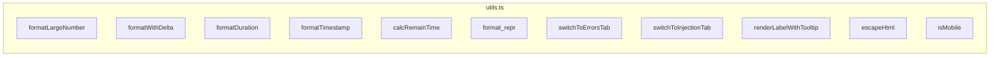

# utils.ts

> 📅 最后更新日期: 2026/06/11

包含 Web 前端通用的格式化工具、UI 辅助逻辑、DOM 操作封装及环境检测函数。

> ⚠️ **已变更**: 旧版文档提及的 `renderLocalTime()` 函数实际不存在于此文件中。新增了 `renderLabelWithTooltip()`、`switchToInjectionTab()`、`calcRemainTime()`、`format_repr()` 四个函数。

## 数值与时间格式化

### `formatLargeNumber(n: number): string`
将大数转换为易读的 HTML 格式。
- `< 10,000,000`：使用 `toLocaleString('en-US')` 千分位逗号分隔。
- `>= 10,000,000`：转换为科学计数法 HTML（如 `~1.23×10⁹`）。

### `formatWithDelta(value: number, delta: number, deltaClass: string, negClass: string): string`
格式化带有增量的数值。若增量非零，则在主数值后追加带颜色的 `+N` 或 `-N` 小字 `<small>` 标签。

### `formatDuration(seconds: number): string`
将秒数格式化为 `HH:MM:SS`（≥1小时）或 `MM:SS`（<1小时）字符串。正数至少展示 1 秒。

### `formatTimestamp(timestamp: number): string`
将 Unix 时间戳（秒）格式化为 `YYYY-MM-DD HH:MM:SS` 本地时间字符串。

### `calcRemainTime(processed: number, pending: number, elapsed: number): number`
根据已处理数、待处理数和已消耗时间线性估算剩余时间。当 `processed` 或 `pending` 为 0 时返回 0。

### `format_repr(obj: unknown, max_length: number): string`
将任意对象格式化为字符串，超过 `max_length` 时截断（前 2/3 + `...` + 后 1/3），保留换行与反斜杠的可见形式。

---

## UI 与路由辅助

### `switchToErrorsTab(nodeFilter?: string): void`
全局路由跳转函数。
- 切换到"错误日志"页签（`activateTab`）。
- 若传入 `nodeFilter`，则设置节点筛选下拉框并触发 `change` 事件以启动查询。

### `switchToInjectionTab(): void`
切换到"任务注入"页签。

### `renderLabelWithTooltip(labelKey: string, tooltipKey: string): string`
渲染带提示气泡的标签 HTML。包含一个 `i` 按钮（`.tooltip-trigger`），悬停或聚焦时显示翻译后的提示文案（`.tooltip-bubble`）。

> 此函数被 `dashboard_statuses.ts` 和 `dashboard_analysis.ts` 广泛使用，用于为"阶段模式"、"调度模式"等专业术语提供即时解释。

---

## 安全与工具

### `escapeHtml(str: string): string`
基础的 HTML 转义函数，防止动态插入文本时的 XSS 风险。转义字符：`&` `<` `>` `"` `'` `/`。

### `isMobile(): boolean`
基于 UserAgent 的简单移动端检测（匹配 `Mobi|Android|iPhone|iPad|iPod`）。

---

## ❌ 不属于 utils.ts 的函数

以下函数**不在** `utils.ts` 中定义，它们属于 `main.ts`：

| 函数 | 实际位置 | 说明 |
|------|---------|------|
| `toggleDarkTheme()` | **main.ts** | 明暗主题切换 |
| `showSettingsSaveStatus()` | **main.ts** | 设置保存状态提示 |

> 旧版文档提及的 `renderLocalTime()` 在源码中不存在，可能为旧版遗留或从未实现。

---

## 函数总览



## 使用示例

```typescript
// ====== 数值格式化 ======
formatLargeNumber(1234567);     // "1,234,567"
formatLargeNumber(1234567890);  // "~1.23×10⁹"

// ====== 增量显示 ======
formatWithDelta(1000, 5, "text-delta-success", "text-delta-success");
// "1,000<small class="text-delta-success">+5</small>"

// ====== 时间格式化 ======
formatDuration(3661);           // "01:01:01"
formatTimestamp(1745400000);    // "2026-04-23 14:40:00"

// ====== 剩余时间估算 ======
calcRemainTime(500, 100, 300);  // 60

// ====== 字符串截断 ======
format_repr("very long string...", 10);  // "very lo...g..."

// ====== 提示标签 ======
renderLabelWithTooltip("status.stageMode", "status.stageModeHelp");
// 返回带 tooltip-trigger 和 tooltip-bubble 的 HTML

// ====== 页签跳转 ======
switchToErrorsTab("StageA");    // 跳转到错误页并筛选 StageA
switchToInjectionTab();          // 跳转到注入页

// ====== HTML 转义 ======
escapeHtml('<script>alert("xss")</script>');
// "&lt;script&gt;alert(&quot;xss&quot;)&lt;&#x2F;script&gt;"

// ====== 移动端检测 ======
isMobile();  // 桌面端 false，移动端 true
```
